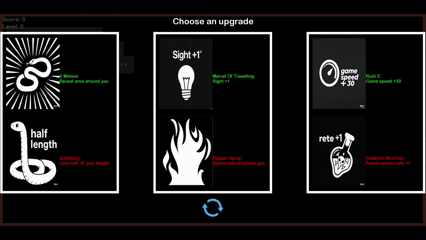

# Greedy Snake

The project **_Greedy Snake_** is a mini-game based on the game **_Snake_**.
The goal of the player is to control the snake and eat as much food as possible in order to attain score.

## Basic Controls
In **_Greedy Snake_**, players can utilize both keyboard and
mouse inputs to navigate and interact with the game.
The controls are as follows:

#### Start the Game: 
Press the **Space Bar** to initiate gameplay.

#### Exit the Game: 
Press the **Esc** key to terminate the game session.

#### Control Snake Direction:
Use the **W**, **A**, **S**, and **D** keys to steer the snake in the desired direction.

#### Manual Control: 
The game will exit auto mode when the player takes manual control of the snake.

#### Fast Mode: 
Press the **F** key to toggle fast mode on or off,
allowing for quicker movement.

#### Slow Mode: 
Press the **C** key to toggle slow mode on or off, 
enabling more deliberate movement.

#### Auto Mode: 
Press the **R** key to enter or exit auto mode, 
where the snake moves automatically. 
_In auto mode, the snake will follow the shortest path to the nearest food that is not in poison, however that tile is revealed or not._
_It will only dodge hazard in front of it._

#### Interact with Clickable Objects: 
 
Use the **left mouse button** to select clickable objects, 
such as upgrade options and re-roll choices.

These controls are designed to enhance the gameplay experience, 
providing players with the flexibility to navigate the challenges of the game effectively.

## Gameplay

The gameplay of **_Greedy Snake_** unfolds as follows:

#### Loading the Game: 
Players begin by loading the game and proceeding to the main menu.

#### Starting the Game: 
Upon initialing the game, 
the player’s snake appears in the top-left corner of the map.
A food item is spawned on the map, 
with a small area around it revealed for easier access.

#### Consuming Food: 
 
When the snake consumes the food, 
the player earns +10 points to their score. 
The points the player earns is dependent on the multiplier upgrade.

#### Food Respawn: 
Food items spawn periodically throughout the game, 
providing ongoing opportunities for score accumulation.

## Upgrades:

To give the player a goal to achieve, an upgrade system is implemented,
which give power ups and power downs to spice up the game.

#### Leveling Up: 
Once players accumulate enough points, 
they will level up, triggering the display of the upgrade screen.

#### Selecting Upgrades: 
Players can choose from three groups of upgrade,
each contains a positive and a negative effect.
One enhance their snake's abilities, such as gaining more points from food, 
while one intensify the hazards, like spawning poison gas more frequently.
After that, the score required for future upgrades is increased.

#### Choose Upgrades:
Press the **1**, **2**, or **3** keys to select a specific upgrade.

#### Re-rolling Upgrades:
If there is no satisfactory upgrade,
the player can re-roll the options given at most once.

## Hazards

In **_Greedy Snake_**, hazards are included as obstacles keeping player from success.
Players must navigate various hazards that can lead to instant defeat. 

The key hazards include:

#### Boundaries
The edges of the game map serve as boundaries. 
Colliding with these walls results in immediate loss.

#### Fog of War
The map is enveloped in fog of war, 
obscuring visibility and preventing players from seeing foods and hazards.
Players can only reveal tiles that they have explored,
adding an element of strategy to navigation.

#### Self-Collision
Players must avoid biting their own tail like an ouroboros. 
If the snake collides with itself, 
it results in instant defeat.

#### Poison Gas
 
- **Spawn Locations:** 
Poison gas can appear randomly across the map.
- **Size Variation:** 
The size of the gas clouds varies based on the length of the snake.
- **Effects:** 
If the snake remains in the poison gas, it will lose length for each tick. 
If the snake's length is insufficient, the snake will suffocate.
- **Duration:** 
Poison gas clouds will dissipate over time, creating temporary hazards.

#### Enemy Snakes
 
- **AI-Controlled:**
Enemy snakes are controlled by (basic) artificial intelligence and spawn from the boundaries of the map.
- **Competition for Food:** 
These snakes actively compete for food resources, adding to the game's challenge.
- **Hazardous Interaction:** 
Enemy snakes can also suffocate in poison gas. 
If a player crashes into an enemy snake, they will lose the game.
If an enemy snake crashes into the player, it will be defeated.
- **Death and Transformation:** 
When an enemy snake is defeated, 
it becomes food for other players, further intensifying competition.

Some upgrades can tune down or intensify the hazards, leading to more synergy.
Players must remain vigilant and strategic while navigating these hazards to survive and succeed in **_Greedy Snake_**.

## Language
**_Greedy Snake_** is written in C++ and CMake.

## Video Demo
Video demo is not currently available.
